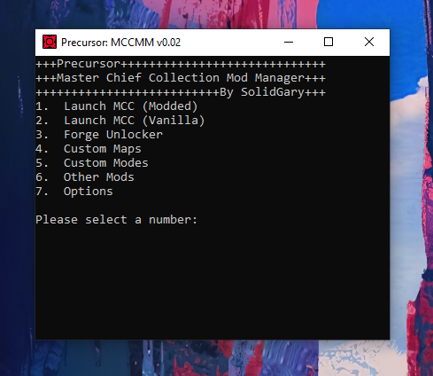

# Precursor
A Mod Manager for The MCC.
 
Terribly written in batch. Porting to C++.
 

 
 
**How to use:**
1. Download the latest release from the releases page.
2. Extract the precursor folder anywhere on your computer.
3. Edit settings.ini so that it matches your install directory.
4. Run the program.

**Known Bugs & Issues:**
-Launching without EAC does not work. Use steam launcher.
-Does not work with Windows Store version.
-Unlimited forge does not install properly. Will.be fixed in the mext release

